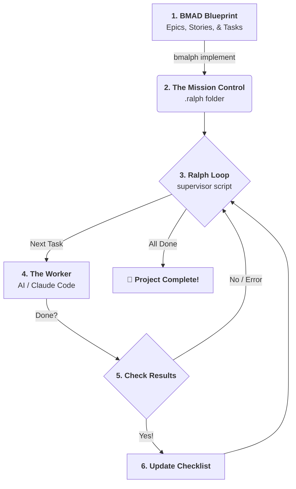

# 🤖 Ralph & BMAD: The "How it Works" Guide

Welcome! If you've ever wondered how this project magically turns your ideas into code, this guide is for you. We'll explain it without using any "tech-speak."

---

## 🗺️ The Big Picture

Think of this project like a **Construction Site**:

1.  **BMAD** is the **Architect**. It draws the blueprints (The "What").
2.  **`bmalph implement`** is the **Project Manager**. It takes those blueprints and creates a daily "To-Do List."
3.  **Ralph (`ralph_loop.sh`)** is the **Supervisor**. It hires a worker (the AI), hands them the list, and makes sure they keep working until every job is done.

---

## 🔄 The Flow (Step-by-Step)



---

## 📂 1. Where are the Tasks? (BMAD)

In the `bmad/` folder, you have your project structure. It looks like a hierarchy:

*   **EPIC:** The "Big Vision" (e.g., "Build a Shopping Website").
*   **STORY:** A "Feature" (e.g., "Add a Shopping Cart").
*   **TASK:** A "Specific Job" (e.g., "Make the 'Add' button blue").

These are usually written in simple text files (Markdown or YAML). When you run `bmalph implement`, the system scans all these folders and gathers every single "TASK" into one master list.

---

## ⚙️ 2. The Engine: What does `ralph_loop.sh` do?

This is the "Loop." It's a script that runs over and over again. Here is exactly what it does in every single loop:

1.  **Pre-Check:** It looks at `.ralph/@fix_plan.md` (the Checklist) to see what's left to do.
2.  **The Hand-off:** It starts the AI "Driver" (like **Claude Code**).
3.  **The Instructions:** It gives the AI two things:
    *   `PROMPT.md`: General rules on how to behave (e.g., "Be professional, write tests").
    *   The Checklist: It tells the AI which box to check next.
4.  **The "Work Session":** The AI goes into your code, makes changes, runs tests, and tries to finish the task.
5.  **The Analysis:** Once the AI stops, Ralph looks at what happened:
    *   Did the AI say "I'm done"?
    *   Did the code break?
    *   Did the AI check off a box in the checklist?
6.  **The Decision:**
    *   If everything is good: Ralph updates the status and starts the loop again for the *next* task.
    *   If there was an error: Ralph tells the AI what went wrong and asks it to try again.
    *   If the AI is stuck: A **"Circuit Breaker"** trips (like in your house!) and stops the loop so you don't waste money/time.

---

## 📝 3. What do the files look like?

### The Checklist (`.ralph/@fix_plan.md`)
This is a simple list of checkboxes. Ralph reads this to know where he is.
```markdown
- [x] Create the database table
- [x] Connect the login button
- [ ] Add the password reset email  <-- Ralph is working on this!
- [ ] Style the header
```

### The Mission Plan (`.ralph/PROMPT.md`)
This is the "Boss's Orders." It tells the AI:
> "Your project ID is 123. You are working on the 'Login' story. Please follow the tasks in `@fix_plan.md` one by one. Don't move to the next task until the current one is tested and working."

---

## 🏗️ The Architecture (Internal Map)

```mermaid
subgraph "User Input (BMAD)"
    direction TB
    E1[Epic 1] --> S1[Story A]
    E1 --> S2[Story B]
    S1 --> T1[Task 1]
    S1 --> T2[Task 2]
end

subgraph "The Translator (bmalph implement)"
    direction LR
    Trans[Transition Logic]
end

subgraph "Ralph Runtime (.ralph/)"
    Prompt[PROMPT.md]
    Checklist[@fix_plan.md]
    Logs[logs/ folder]
end

subgraph "The Supervisor (ralph_loop.sh)"
    Loop[The Continuous Loop]
    CB[Circuit Breaker]
end

E1 -.-> Trans
Trans -.-> Prompt
Trans -.-> Checklist
Checklist <--> Loop
Loop <--> CB
Loop --> AI[Claude / Worker]
```

---

## ❓ Common Questions

**"Where does the prompt come from?"**
The "base" prompt comes from templates in the project (`ralph/templates/PROMPT.md`). When you run `implement`, it "fills in the blanks" with your specific project details (your PID, your stories, and your tasks).

**"How does it know which task to do?"**
It always looks for the first unchecked box `[ ]` in your `@fix_plan.md` file.

**"What if it fails?"**
Ralph has a "Rate Limit." It only allows a certain number of attempts per hour so it doesn't run forever. If it fails too many times with the same error, it stops and waits for you to fix it manually.
